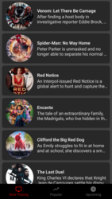
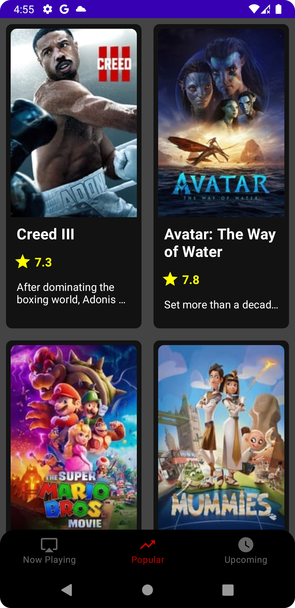
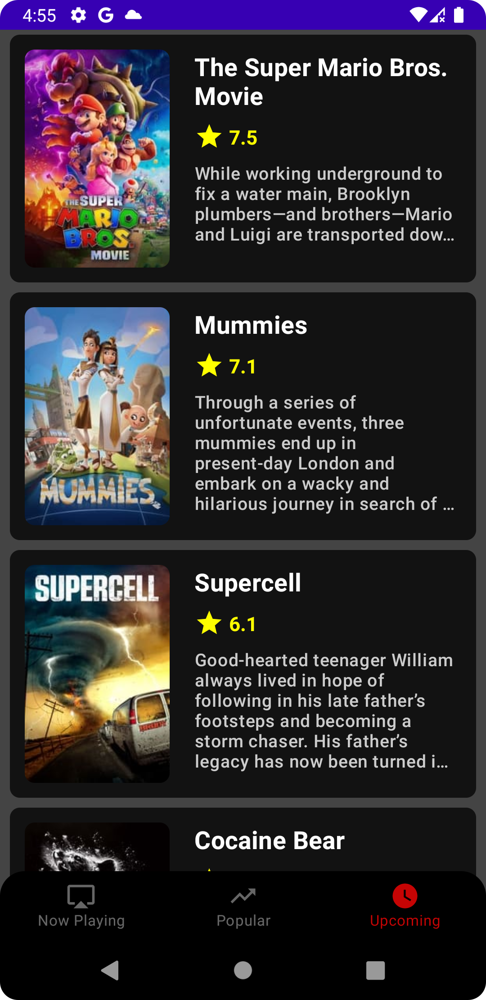
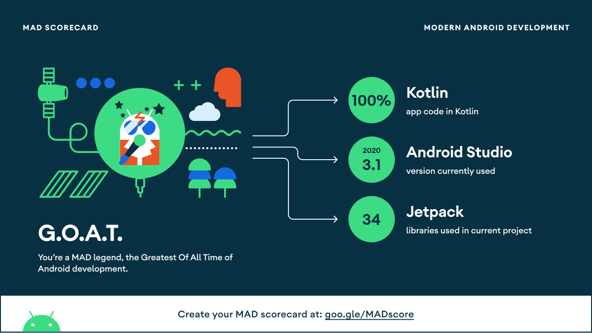

# Nextflix-Composable


[](https://android-arsenal.com/details/1/8264)

A Clean Architecture App to show use of  multi-module-architecture in a Jetpack Compose.

The modules are as follow:

* app: Presentation Layer

* domain: Business Logic Layer

* data: Data Access Layer

* common: A View Items Layer

* nowplaying: A Screen Layer

* popular: A Screen Layer

* upcoming: A Screen Layer

* buildSrc: Includes Versions of Dependecies 

## --- Requirement ---
You should add api key to Network Module before build app.

## Screenshots

<table style="padding:10px">
	<tr>
		<td align="center">
			<h2>Now Playing Screen</h2>
		</td>
		<td align="center">
			<h2>Popular Screen</h2>
		</td>
  <td align="center">
			<h2>Upcoming Screen</h2>
		</td>
  	</tr>
	<tr>
    	<td align="center">
			
    	</td>
		<td align="center">
			
    	</td>
  <td align="center">
			
    	</td>
  	</tr>
</table>

## Shimmer Effects
<p>
 
 
</p>


## Tech Stack

* Multi-Module-Architecture
* Kotlin
* Jetpack Compose
* Material Design
* Hilt 
* Coroutines
* Flow
* Paging
* Navigation
* AndroidX
* Retrofit
* Coil
* Solid Principles

## MAD Scorecard
<table style="padding:10px">
	<tr>
		<td align="center">
			<h2>Modern Android Development</h2>
		</td>
  	</tr>
	<tr>
    	<td align="center">
			
    	</td>
  	</tr>
</table>

## TODOs

* Unit Tests
* Implementation of static code analysis tool(ktlint etc.) 
* Better UIs
* Add More Screens (Details etc.)
* Error Handling
* Favorite Icon

## Screens
* [Click here for Now Playing Screen](https://github.com/TalhaFaki/Multi-Module-Nextflix-Composable/blob/master/nowplaying/src/main/java/com/talhafaki/nowplaying/NowPlayingScreen.kt)
* [Click here for Popular Screen](https://github.com/TalhaFaki/Multi-Module-Nextflix-Composable/blob/master/popular/src/main/java/com/talhafaki/popular/PopularScreen.kt)
* [Click here for Upcoming Screen](https://github.com/TalhaFaki/Multi-Module-Nextflix-Composable/blob/master/upcoming/src/main/java/com/talhafaki/upcoming/UpcomingScreen.kt)

## Follow me here:
https://linktr.ee/talhafaki

## Did you find this repository helpful?
Don't forget give a star.

## Didn't you?
Then fork this repo, make it better and don't forget give a STAR.

```xml
MIT License

Copyright (c) 2021 Talha Fakıoğlu

Permission is hereby granted, free of charge, to any person obtaining a copy
of this software and associated documentation files (the "Software"), to deal
in the Software without restriction, including without limitation the rights
to use, copy, modify, merge, publish, distribute, sublicense, and/or sell
copies of the Software, and to permit persons to whom the Software is
furnished to do so, subject to the following conditions:

The above copyright notice and this permission notice shall be included in all
copies or substantial portions of the Software.

THE SOFTWARE IS PROVIDED "AS IS", WITHOUT WARRANTY OF ANY KIND, EXPRESS OR
IMPLIED, INCLUDING BUT NOT LIMITED TO THE WARRANTIES OF MERCHANTABILITY,
FITNESS FOR A PARTICULAR PURPOSE AND NONINFRINGEMENT. IN NO EVENT SHALL THE
AUTHORS OR COPYRIGHT HOLDERS BE LIABLE FOR ANY CLAIM, DAMAGES OR OTHER
LIABILITY, WHETHER IN AN ACTION OF CONTRACT, TORT OR OTHERWISE, ARISING FROM,
OUT OF OR IN CONNECTION WITH THE SOFTWARE OR THE USE OR OTHER DEALINGS IN THE
SOFTWARE.
